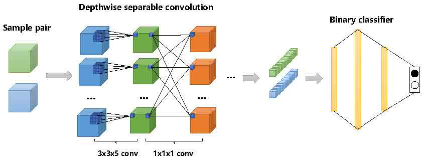

# 3DLSN
This is an official implementation of "A 3D Lightweight Siamese Network for Hyperspectral Image Classification with Limited Samples".

## Requirements
* torch 1.7
* scikit-learn 0.24
## Run
```
# 训练siamese network
python train.py --name PaviaU --gpu 0 --epoch 100

# 训练classifier
python classify_siamese_Depthwise.py --name PaviaU --gpu 0
```